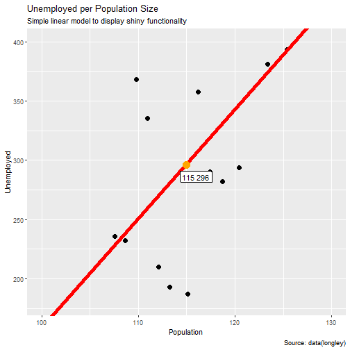

Nikolaos Perdikis - Linear Model to longley dataset
========================================================
The application can be accessed in:
https://nikolasperdikis.shinyapps.io/shiny_project/

Brief description of functionality:

- Read "longley" dataset
- Linear Model, outcome: Unemployed - Predictor: Population
- Slider input to enter new data for Population value
- Plot the result

User Interface
========================================================
- The user interfaces with the app via the mouse, exclusively.  
No knowledge of R programming, model fit or ggplot is required.  
When the app launches, a default prediction is provided,  
for a population size of 115000.  

- The user can then use the slider to the left to alter the population predictor.  

- "Show/hide Linear Model" can be checked/unchecked to view the model and prediction in the graphic  

- User has to click on "Submit" for changes to take effect 

Server - Side Operations 1/2
========================================================
Once user input is received, the server will generate a prediction,  
based on the value the user entered. This is a very simple linear model,   
with predictor being the population size, and outcome being the amount of Unemployment. 
The model fit would look like:

```r
model1 <- lm(Unemployed~Population, data=longley)
```
and the prediction, given a user entered value of *115*, (values entered in 100K units), would be:


```r
predict(model1,newdata=data.frame(Population=115)
```
Server - Side Operations 2/2
========================================================
The graph is generated in *gglot*, holding different elements for:
- The datapoints of the dataset in black,  (*mandatory, all items below optional)
- The model fit, as a *geom_abline* element in red,  
- The prediction and its label  

Thank You
========================================================
